# TechnoNext Android Assessment

A modern Android app showcasing posts from JSONPlaceholder API with user authentication, favorites,
and search functionality.

## 🚀 Quick Start

### Prerequisites

- Android Studio Ladybug or later
- Java 17 to 21
- Minimum Android SDK API 24

### Build Commands

```bash
./gradlew assembleDebug    # Build debug APK
./gradlew assembleRelease  # Build release APK
./gradlew test             # Run unit tests
```

## 🏗️ Architecture

**Clean Architecture + MVVM** with gradle multi-module structure:

```
app/                  # Main application
feature/              # Feature modules (posts, favourites, signin, signup, etc.)
core/
  ├── data/           # Repository implementations
  ├── data-cache/     # Room database
  ├── data-datastore/ # DataStore for session management
  ├── data-network/   # Retrofit API
  ├── domain/         # Business logic
  └── ui/             # Shared UI components
```

### Tech Stack

- **UI**: Jetpack Compose + Material 3
- **Networking**: Retrofit + OkHttp
- **Database**: Room + Paging 3
- **DI**: Hilt
- **Async**: Kotlin Coroutines + Flow
- **Testing**: JUnit, Mockito, MockWebServer

## 📱 Features

- **Authentication**: Sign up/in with email validation and password strength requirements
- **Posts Feed**: Paginated posts with search and pull-to-refresh
- **Favorites**: Mark/unmark posts with persistent storage
- **Offline Support**: Room database caching
- **Session Management**: Persistent login state with Proto DataStore

## 📸 Screenshots

### Authentication
| Sign In | Sign Up (Valid) | Sign Up (Invalid) |
|---------|-----------------|-------------------|
| 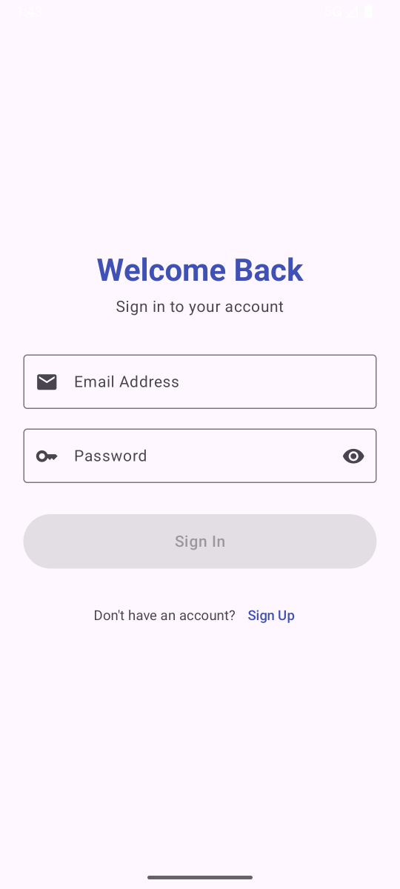 | 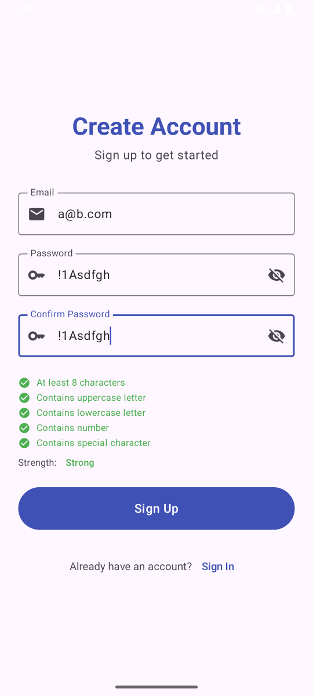 | 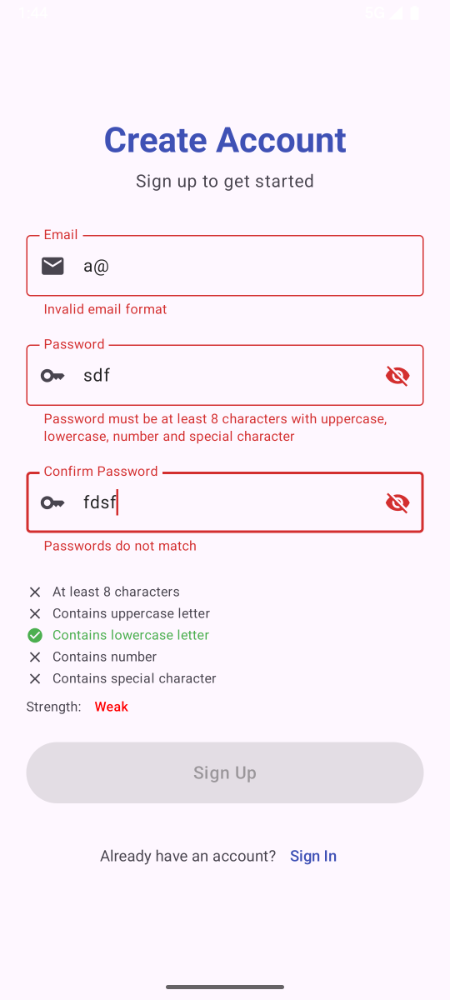 |

### Posts Feed
| Light Theme | Dark Theme | Search | Empty State |
|-------------|------------|--------|-------------|
| 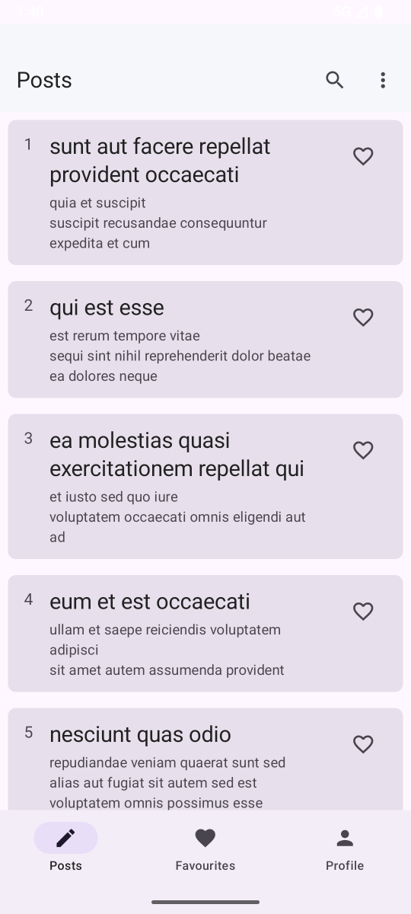 | 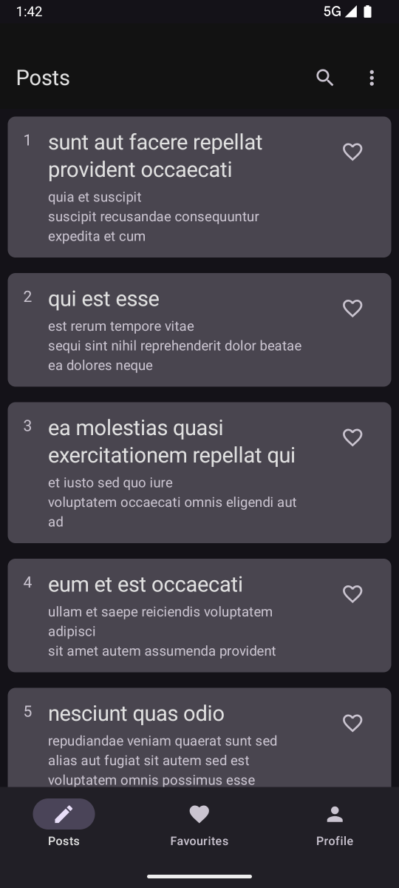 | 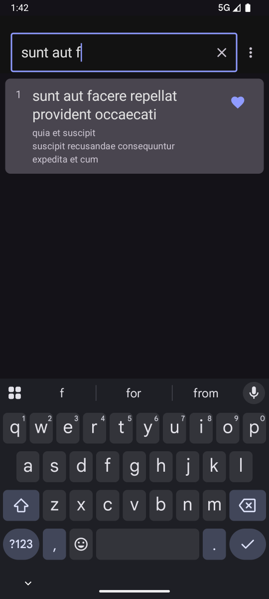 | 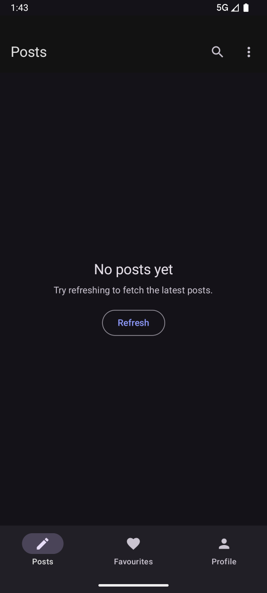 |

### Favorites
| Favorites List | Empty Favorites | Clear Dialog |
|----------------|-----------------|--------------|
| 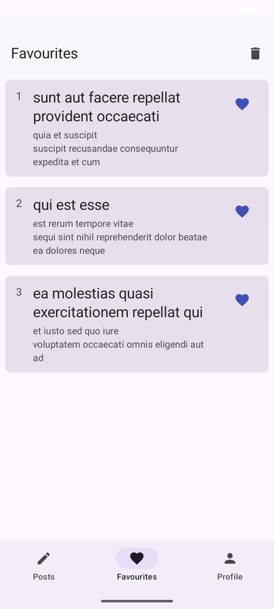 | 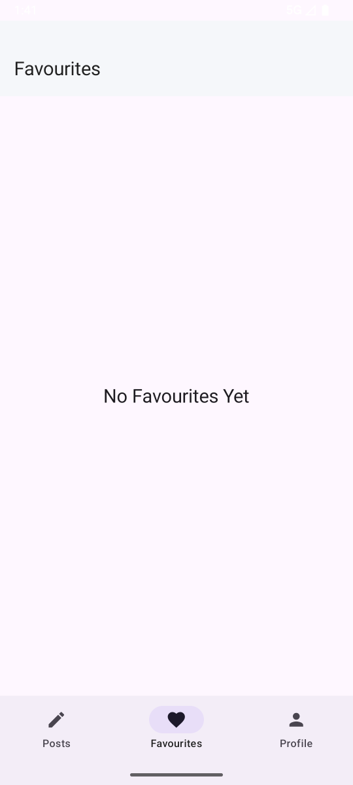 | 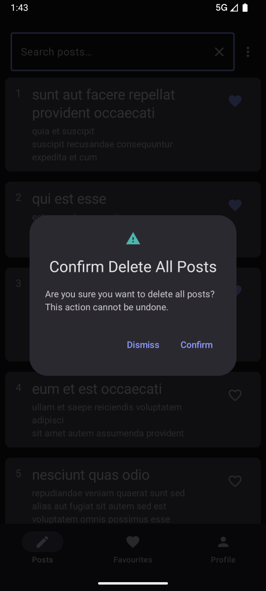 |

### Profile
| Light Theme | Dark Theme |
|-------------|------------|
| 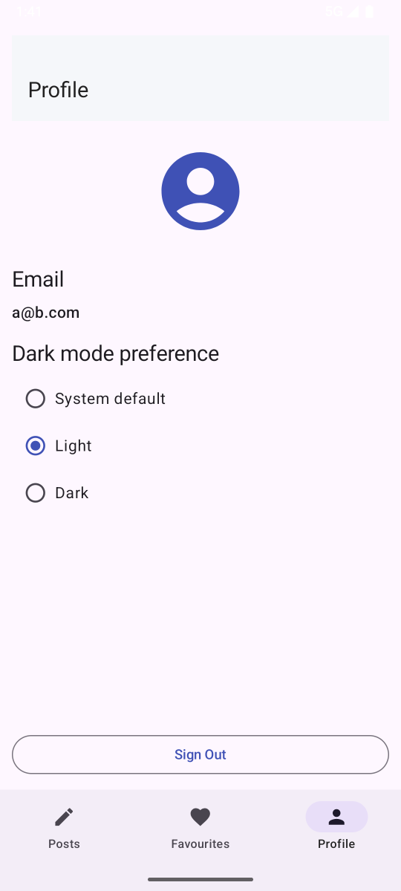 | 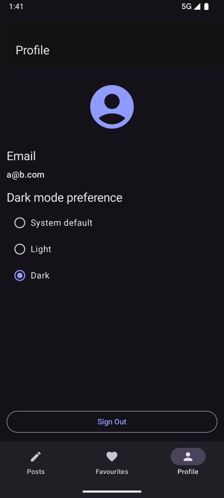 |

## 🎥 Demo Video

Watch the app demo:

### Online
🔗 [View Demo Video](https://github.com/SrizanX/srizans-technonext-submission/blob/dev/screen_recording.mp4)

